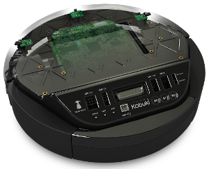

Kobuki Firmware
===============

----

This package provides a home for the firmware binaries, which should only ever be needed if you need to re-flash or upgrade your Kobuki's firwmare.

**This package is not a necessary dependency for the Kobuki runtime.**

----

## User Documentation

For information on troubleshooting a USB connection, refer to [Kobuki Documentation/Troubleshooting](https://kobuki.readthedocs.io/en/devel/troubleshooting.html).

For information about and upgrade instructions, refer to the 
[Firmware](https://kobuki.readthedocs.io/en/devel/firmware.html) section in the
[Kobuki Documentation](https://kobuki.readthedocs.io/).
